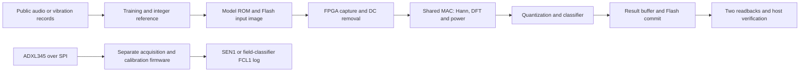

# UPduino Acoustic Fault Classification and Shared DSP / INT8 Accelerator

An FPGA research project implementing fixed-point signal processing and fault classification on an iCE40UP5K / UPduino 3.1. The host trains models, prepares input images, and checks results; the FPGA performs signal processing and classification.

## Current results

The current main experiment recognizes **new recordings from four already covered fans**, using a frozen integer DSP front end and INT8 linear classifier. One final evaluation on 720 held-out recordings detected **317/320 faulty recordings**, produced **8/400 false alarms**, and achieved **AUC 0.99841**. Each machine independently passed the predefined gates. See the [final test report](docs/known-final-test.md).

The frozen implementation completed **22 passing hardware replays across 13 distinct public recordings**: 1248 windows with one MAC and 2184 with four MACs. Each startup processes 156 consecutive windows; totals across restarts are not one continuous run. On matched recordings, four MACs provide approximately **3.782x compute speedup**. These are physical FPGA replays, not microphone or field-fan tests. See [hardware results and measurement boundaries](docs/known-hardware-results.md).

Cross-machine generalization has **not** met the acceptance criteria. Physical clock frequency, power, actual ADXL345 acquisition, and a real field-trained model remain unmeasured or incomplete. The [current evidence index](artifacts/evidence/current-status.md) distinguishes saved results, failed attempts, and outstanding work.

## English publication snapshot

This is an English publication snapshot of engineering work completed through September 13, 2026. Documentation, generated report text, interface labels, metadata, and the published commit history are English. Original local records and history remain preserved separately.

Read the [publication scope](docs/repository-snapshot.md), [third-party notices](THIRD_PARTY_NOTICES.md), and [publication integrity guide](publication/README.md). Bulk public data caches, private machine records, local tool environments, the pre-project Flash backup, and downloaded third-party checkpoints are excluded. Relevant provenance and restoration instructions are retained.

Published evidence can contain translated prose or redacted paths. Original experiment digests are not silently rewritten to imply that translated files were the originals. The publication manifest records original and published SHA256 values. Raw model parameters, numerical arrays, RTL, bitstreams, and result-readback bytes are preserved unless an explicit exclusion is recorded.

## Completed work and historical boundaries

| Route or experiment | Saved result | Scope |
| --- | --- | --- |
| Four covered fans, integer DSP + INT8 | 317/320 detections, 8/400 false alarms, AUC 0.99841; each machine passes | Frozen final software evaluation; separately verified on FPGA |
| Earlier supervised same-machine model | Validation: 30/30 detections, 2/40 false alarms; test: 50/50 and 1/40; AUC 1.000 | Earlier software model, not the current hardware version |
| Frozen model on previously unseen fan 02 | 23/30 detections, 24/40 false alarms, AUC 0.6033 | Cross-machine criteria failed; model and threshold unchanged |
| Three-machine development, machine 06 holdout | 64/80 detections, 60/80 false alarms, AUC 0.6388 | No candidate passed all three development folds; holdout evaluated once |
| Early acoustic prototype | Validation AUC 0.6533, 13.3% recall at 5% FPR | RTL and 1000-frame physical replay passed numerical checks; algorithm quality failed |
| 90 acoustic feature candidates | Best validation recall 13/30 at 5% recording FPR | Higher quality gates failed; no new RTL deployment |
| CWRU neighboring-bin model | INT8 macro-F1 0.93236; accuracy 93.18% (997/1070) | Same test rig, later cross-load assessment, not independent field accuracy |

Unsuccessful temporal, CNN, source-invariant, pretrained-feature, MIMII DUE, noise-augmentation, and paired-restoration experiments are retained. Start with the [known-machine protocol](docs/known-machine-evaluation.md), [cross-machine audit](docs/acoustic-generalization-audit.md), [DUE training report](docs/due-training-results.md), and [current index](artifacts/evidence/current-status.md).

## Architecture



The current known-fan pipeline uses 1024-sample windows at 16 kHz, 512 frequency bins, 156 windows per recording, and an INT8 linear classifier. The [integer deployment contract](docs/known-integer-deployment.md) defines scaling, rounding, accumulation, logarithms, normalization, thresholds, and interfaces.

The historical CWRU pipeline uses N=1024 at 12 kS/s. One or four MAC lanes share a numerical contract: 40-bit DFT accumulation, INT8 network weights/activations, and INT32 accumulation. The original 16 individual frequency powers are compared with three-bin sums around the same 16 centers.

CWRU labels are `0=inner-race defect`, `1=outer-race defect`, and `2=rolling-element defect`; this experiment has no normal class. These labels do not apply directly to static, hand-held, or household-fan ADXL345 measurements. The single-bin model achieved 76.82% accuracy and macro-F1 0.7713, below the macro-F1 target and the 77.10% RMS baseline. The neighboring-bin test reused 3 HP records previously evaluated for the older model. It is not a new external test. See [model evidence](docs/data-and-model.md), [candidate comparisons](docs/model-options.md), and [neighboring-bin test](docs/neighbor-test-results.md).

## Running the project

The saved environment used Python 3.12, NumPy/SciPy, PyTorch, cocotb, Verilator **5.051 devel**, Yosys, nextpnr, SymbiYosys, and Z3. Exact versions are in [environment.json](artifacts/evidence/environment.json). The bootstrap script pins OSS CAD Suite 2026-09-05 and verifies its checksum; other platforms need the corresponding toolchain.

On macOS ARM64 with Python 3.12:

```bash
python3 scripts/bootstrap.py
source scripts/env.sh
make help
make quick
make module MODULE=core
```

`make quick` runs Python tests and a short core regression. `make module MODULE=...` selects a complete module. `make release` (also `make verify`) is full offline verification. These commands do not program hardware. Consult [workflow and verification](docs/workflow-efficiency.md) before longer runs. Historical audits can require omitted original local files or downloads; read the publication integrity guide before interpreting absent data as a new experimental failure.

```bash
make test
make core
make dsp-cases
make paced
make formal
make flash
make board
make neighbor
make sensor
make nn-edges
make quant-formal
make coverage
make neighbor-report
```

DSP cases cover non-bin-centered tones, phase, clipping, and two tones in four configurations. FIFO checks are bounded to 64 cycles, not unbounded proofs. Negative controls intentionally fail to verify that assertions and formal checks detect incorrect behavior. See [core verification](docs/core-verification.md), [quantization checks](docs/quantization-formal.md), [coverage](docs/rtl-coverage.md), and [offline completion](docs/offline-completion.md).

Restore public source data through [data workflows](docs/data-workflow.md) and official manifests. For CWRU, use `python scripts/download_cwru.py`. Preserve frozen outputs; any explicitly authorized retraining must use a new directory, for example `python scripts/train_export.py --artifacts artifacts/reproduction`.

## Replay firmware and host exchange

Historical CWRU build and image preparation:

```bash
# Original single-bin model
python scripts/build_board.py --lanes 4
python scripts/prepare_replay.py

# Neighboring-bin model: model, waveform image, and bitstream must match
python scripts/build_board.py --lanes 4 --model artifacts/model_neighbor/model.json
python scripts/prepare_replay.py --model artifacts/model_neighbor/model.json --vectors artifacts/vectors_neighbor --output build/replay_neighbor.bin
python sim/run_flash_system.py --model artifacts/model_neighbor/model.json
```

Successful builds contain `board.bin`, resource reports, and post-route timing. Historical portable copies are under `artifacts/firmware/`; corrected internal-clock hardware builds are under `build/hardware-2026-09-10/runs/`. Attempt manifests bind the exact bitstream and hash. Older pinout or pre-wakeup firmware must not be substituted for a later run.

CWRU Flash partitions are configuration at `0x000000-0x03FFFF`, input from `0x040000`, and log from `0x300000`. Up to 16 source windows are replayed at fixed cadence for up to 1000 frames. Results are buffered on-chip and written after stopping. Model-hash/input-CRC mismatches are rejected; committed logs are not overwritten; the commit marker is written last. See the [Flash protocol](docs/flash-protocol.md).

These commands preview partition-constrained operations by default:

```bash
python scripts/flash_exchange.py write-input --file build/replay.bin
python scripts/flash_exchange.py clear-log --file build/erased-log.bin
python scripts/flash_exchange.py read-log --file build/result-log.bin
python scripts/flash_exchange.py parse-log build/result-log.bin
python scripts/flash_exchange.py verify --image build/replay.bin --log build/result-log.bin
python scripts/program_board.py --bitstream build/board_l4/board.bin --image build/replay.bin --backup measurements/backups/first-flash.bin
```

Hardware execution requires an explicitly verified local profile, `--execute`, and a full local recovery backup. Every USB Flash operation releases FPGA reset: install the firmware first and let the final log erase start the run. SPI Flash programming is not JTAG. An archived profile does not verify a newly connected board.

## Sensor and field-classifier work

The ADXL345 chain uses 3.3 V four-wire SPI, Mode 3, 1 MHz, and INT1 for DRDY. Defaults are 800 S/s, ten minutes of statistics, and the first 30 seconds of single-axis raw samples and service timestamps. Data are buffered in RAM and exported after stopping. Initialization checks device ID `0xE5`; counters distinguish dropped output, sensor-visible overrun, and abnormal read intervals.

A single MAC computes DC removal, Hann windowing, and 16 DFT bins per 256-sample window, retaining the last complete spectrum. Raw-count spectral powers are separate from calibrated mg statistics and are neither Welch PSD nor bearing-fault labels. `--no-spectrum` selects acquisition/calibration only.

```bash
python scripts/build_sensor.py --rate 800 --axis 2
python sim/run_sensor_system.py
python scripts/analyze_sensor.py decode build/sensor-log.bin --output measurements/run01/z.csv
python scripts/analyze_sensor.py calibrate --positive measurements/plus/z.csv --negative measurements/minus/z.csv --axis z --output measurements/calibration.json
python scripts/analyze_sensor.py validate measurements/heldout/z.csv --calibration measurements/calibration.json --expected-g 1 --output measurements/heldout-report.json
python scripts/analyze_sensor.py noise measurements/run01/z.csv --odr 800 --axis z --calibration measurements/calibration.json --output measurements/noise-800.json
```

Field measurements must actually be collected; they have not been fabricated. Deploy `offset_q8` and `gain_q20` with `build_sensor.py`; defaults provide nominal counts-to-mg conversion, not measured calibration. Read-service intervals are not ADC jitter, and static two-point calibration is not absolute frequency-response calibration.

The sensor spectrum buffer was moved into the third SPRAM tail. The matched build uses 4915 LC and three SPRAM blocks, passes 12 MHz, and has estimated Fmax 16.53 MHz. The separate FCL1 field classifier has code and simulation evidence using a clearly identified synthetic fixture. Real field training, continuous host output, noise runs at 100/400/800 S/s, remounting experiments, and electrical measurements remain outstanding. See [storage optimization](docs/storage-optimization-2026-09-08.md), [field system](docs/field-system.md), and [hardware validation](docs/hardware-validation.md).

## Exploring the evidence

- [Real-window code walkthrough](docs/code-walkthrough.md): samples, fixed-point spectra, features, matrix operations, and RTL states.
- [Interactive known-fan walkthrough](artifacts/known-recording-walkthrough/index.html): saved physical readbacks, with audio playback on the host.
- [24-second simulation video](artifacts/demo/simulation-demo.mp4): explanatory animation labeled **NO PHYSICAL HARDWARE**, not board footage or live acquisition.
- [Historical CWRU hardware report](docs/hardware-results-2026-09-10.md): bit-exact replay, overload/recovery, and 77,470 versus 299,411 active cycles (3.865x). Repeated use of nine source windows is not independent test data.

| Directory | Contents |
| --- | --- |
| `src/vibfpga/` | Data checks, reference DSP/classifiers, Flash formats, sensor analysis |
| `rtl/core/`, `rtl/platform/` | Computation, FIFOs/ROM, iCE40 SPRAM integration |
| `rtl/io/` | SPI, Flash, paced replay, ADXL345, fixed-point calibration |
| `scripts/` | Training, builds, preparation, audits, hardware interfaces |
| `sim/`, `formal/`, `tests/` | Numerical checks, peripheral models, reset/backpressure/overload cases, bounded proofs |
| `artifacts/` | Frozen models, vectors, scores, complete experiment results, charts, evidence |
| `build/`, `measurements/` | Historical builds and actual replay records, including failures |
| `publication/` | Upload decisions, original/published hashes, publication verification |

The Digital IC contribution is the RTL, datapath and memory scheduling, numerical verification, assertions and bounded formal checks, synthesis, and timing analysis. OpenROAD standard-cell implementation, ASIC sign-off/fabrication, measured power, and JTAG are not completed project results.
