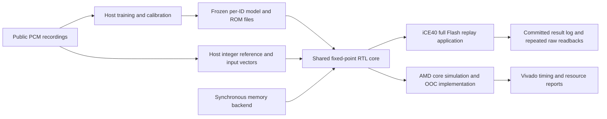

# Fixed-Point DSP and INT8 FPGA Accelerator

A digital-hardware project combining shared-MAC signal processing, quantized inference, memory scheduling, protocol verification, and timing-driven RTL optimization. The primary application classifies public fan recordings on an **iCE40UP5K / UPduino 3.1**. The same compute core also runs in **AMD FPGA simulation and out-of-context implementation using Vivado**.

The host prepares data, trains and freezes models, generates integer references, and verifies readbacks. The FPGA performs the deployed DSP and classification. Earlier CWRU bearing experiments and separate ADXL345 sensor/field-classifier firmware are retained alongside the current fan accelerator.

This README describes completed work through **October 6, 2026**. The [evidence index](artifacts/evidence/current-status.md) distinguishes original laboratory receipts from the English publication.

## Current results

| Result | Verified scope | Evidence |
| --- | --- | --- |
| **317/320 fault detections, 8/400 false alarms, AUC 0.99841** | One frozen software evaluation on 720 held-out recordings from covered fan IDs 00/02/04/06; every ID passes the predefined gates | [Final evaluation](docs/known-final-test.md) |
| **Approximately 3.782x compute speedup with four MACs** | Matched recordings and core activity cycles; one-/four-MAC input cadences differ | [Latest physical report](artifacts/vivado-portability-v1/physical-report.md) |
| **AMD routed internal delay: 16.888 → 15.018 ns, 11.07% lower** | ID00 four-MAC core, Vivado 2024.2, `xc7a35tcpg236-1`, 50 MHz OOC constraint | [Timing experiment](artifacts/vivado-portability-v1/report.md) |
| **iCE40 routed internal delay: 71.220 → 58.507 ns, 17.85% lower** | ID00 four-MAC complete application, fixed seed 1; seeds 2/3 also improve | [Comparison data](artifacts/vivado-portability-v1/comparison.json) |
| **11 passing replays over 8 distinct public recordings, 1716 windows** | Latest pipeline: 1248 four-MAC windows and 468 one-MAC windows; expected overload failure and same-bitstream reset recovery also checked | [Physical audit](artifacts/vivado-portability-v1/hardware-audit.json) |
| **5304 local and 1716 Vivado full-recording simulation windows** | Stagewise integer agreement; Vivado checks 5,282,827 intermediate numerical events | [Verification summary](artifacts/vivado-portability-v1/report.md) |

The model-quality evaluation, RTL simulations, implementation timing, and physical replay counts are separate evidence. The latest 11 passing physical runs are additional to the historical **22 passes across 13 recordings** documented in [known-hardware-results.md](docs/known-hardware-results.md). Unique-recording counts must not be added across versions without checking overlap. Each normal startup processes **156 consecutive windows**; totals across restarts are not one continuous physical run.

The physical clock remains **nominal 12 MHz HFOSC**. Its actual frequency and power have not been measured. Timing optimization improves implementation margin; it does not establish faster measured recording throughput. No AMD board was used.

## Current fan accelerator

### Recording-level algorithm

Each deployed fan ID has its own frozen parameters and threshold. The host selects the installed machine ID; the FPGA does not automatically identify an unfamiliar fan or load one universal model.

A recording supplies its first **159,744 PCM16 samples**: 156 nonoverlapping 1024-sample windows at an intended 16 kHz, covering 9.984 seconds. The core produces **one final score per recording**, after combining the windows:

1. Round/scale the raw input, remove each window's DC mean, and apply a fixed-point Hann window.
2. Compute real and imaginary DFT components for **bins 1–512**, using synchronous coefficient ROMs and shared multiplier lanes.
3. Compute each bin's squared magnitude and accumulate power across all 156 windows.
4. Apply the integer log2 approximation, floor, and model-specific normalization.
5. Quantize features to symmetric **INT8 [-127, 127]**, preserving round-to-nearest, ties-to-even behavior.
6. Accumulate the 512 INT8 weighted features plus bias into an **INT32 score** and compare it with the frozen threshold. The deployed linear classifier requires no sigmoid.

The current core uses **48-bit DFT accumulation** and **64-bit power/normalization arithmetic**. Wide operations are scheduled over the shared datapath. These widths belong to the current fan pipeline; the earlier CWRU core has a separate arithmetic contract.

[known_fixed.py](src/vibfpga/known_fixed.py) is the integer reference; [known_spectral_core.sv](rtl/core/known_spectral_core.sv) is the compute RTL. Scaling, overflow behavior, rounding order, logarithms, and threshold selection are specified in the [integer deployment contract](docs/known-integer-deployment.md). This is a selected-bin DFT implementation; an FFT replacement has not been implemented.

### Datapath, buffering, and cadence

One or four logical MAC lanes are shared across windowing, DFT, power decomposition, normalization, and classification. Input double buffering overlaps reception and processing. Ready/valid handshakes, frame IDs, stage counters, and intermediate debug events expose numerical and scheduling behavior.

At nominal 12 MHz, the tested four-MAC application accepts one sample every **750 cycles**, corresponding to nominal **16 kS/s**. The normal one-MAC replay uses **1500 cycles/sample**, corresponding to nominal **8 kS/s**. The one-MAC application does not sustain the four-MAC input cadence; that limitation is checked by an intentional overload test.

The approximately 3.782x speedup compares **active compute cycles on the same recording**. It does not compare acquisition duration or complete wall-clock latency under these different input cadences.


```mermaid
flowchart LR
    A[Public PCM recordings] --> B[Host training and calibration]
    B --> C[Frozen per-ID model and ROM files]
    A --> R[Host integer reference and input vectors]
    C --> K[Shared fixed-point RTL core]
    R --> K
    M[Synchronous memory backend] --> K
    K --> I[iCE40 full Flash replay application]
    K --> V[AMD core simulation and OOC implementation]
    I --> L[Committed result log and repeated raw readbacks]
    V --> T[Vivado timing and resource reports]
```

## Cross-FPGA memory and timing optimization

### Portable memory contract

[spram16k.sv](rtl/platform/spram16k.sv) provides a 16K × 16-bit single-port storage interface with three backends:

- `ICE40`: `SB_SPRAM256KA` for the UPduino application.
- `AMD_FPGA`: synchronous RAM with block-RAM inference.
- No platform macro: reference behavioral RAM.

Address/control are sampled on the rising edge; read data updates after that edge for consumption at the next edge. Writes use the full 16-bit word. Write-cycle output is not a valid read; reset does not clear storage; uninitialized contents must not affect valid computation. Defining both platform macros fails the build. Contract tests cover all three backends.

The same core/model behavior is checked across platforms, while the implementation scopes differ: **iCE40 includes the full Flash replay application; AMD implements the complete observable compute core out of context**, retaining debug and cycle ports.

### Register boundary driven by the reported critical path

Three versions keep the comparison controlled:

| Version | Purpose |
| --- | --- |
| A | Preserved historical deployment and its original dependencies |
| B | Portable memory implementation, `QUANT_PIPELINE=0`; optimization baseline |
| C | Same implementation with `QUANT_PIPELINE=1`; accepted candidate |

The reported improvement is **B → C**, rather than an A → B platform/mapping change.

B combines the final wide partial-product accumulation, ties-to-even rounding, symmetric saturation, and sign restoration in one combinational cycle. C registers the final normalization accumulation in the existing `wide_acc`, then performs quantization in a new **`NORM_QUANT` state (24)**. Power computation keeps its original schedule. Feature events retain their values, indices, and count, but occur one cycle later; reset in the added state cancels the transaction.

This adds **512 NN/total activity cycles per recording**, with unchanged preprocessing, DFT, and power counts. On the matched seven-recording regressions, the maximum activity overhead is **0.001158% for four MACs** and **0.000306% for one MAC**, with unchanged input cadence and zero normal-input backpressure.

The actual AMD worst paths include retained debug registers: B ends at `dbg_value_reg[58]` after the shared multiplier, wide accumulation, and rounding logic; C's bottleneck shifts toward purpose control/shared multiplication/wide accumulation ending at `dbg_value_reg[53]`. These are worst paths of the full observable core, rather than a claim about a feature-only endpoint.

### Timing and resource tradeoffs

AMD uses **Vivado 2024.2, SW Build 5239630**, `xc7a35tcpg236-1`, two threads, default implementation directives, no incremental implementation, a **20 ns clock**, and **2 ns input/output delays**. The I/O delays are module-interface assumptions. No false-path or multicycle exception hides the synchronous reset or original single-cycle paths.

| AMD ID00, four MACs | Internal delay ns | Setup WNS ns | Hold slack ns | LUT | FF | DSP | BRAM tiles |
| --- | ---: | ---: | ---: | ---: | ---: | ---: | ---: |
| B | 16.888 | 2.759 | 0.110 | 1814 | 1306 | 7 | 5.5 |
| C | 15.018 | 4.929 | 0.136 | 1739 | 1308 | 7 | 5.5 |

C's four-MAC implementations for **ID00/02/04/06** pass the 50 MHz setup and hold checks with no unconstrained paths or black boxes. ID00 one-MAC AMD coverage is synthesis and functional simulation, rather than a claimed routed timing result.

The iCE40 comparison fixes UP5K/SG48, the board PCF, ABC9 register mapping, and a **13.2 MHz implementation constraint**:

| iCE40 ID00, four MACs | Post-route LC / 5280 | DSP | EBR | SPRAM | Seed 1 Fmax MHz | Seed 2 Fmax MHz | Seed 3 Fmax MHz |
| --- | ---: | ---: | ---: | ---: | ---: | ---: | ---: |
| B | 5168 | 4 | 28 | 1 | 14.041 | 13.770 | 14.005 |
| C | 5221 | 4 | 28 | 1 | 17.092 | 17.138 | 17.406 |

The accepted C one-MAC ID00 application uses **4765 LC, 1 DSP, 25 EBR, and 1 SPRAM**, with estimated Fmax **16.953 MHz**. Final four-MAC images for all four IDs fit the device and meet the implementation constraint. LC is an iCE40 combined logic-cell count; it is not directly comparable to AMD LUT counts. FPGA Fmax and path delays are tool estimates, not measured board frequency.

Candidate C met all correctness, timing, resource, cadence, and cycle-overhead gates, so additional D/E optimization candidates were unnecessary. The frozen models and thresholds were unchanged, and the final test recordings were not revisited. See the [full report](artifacts/vivado-portability-v1/report.md), [comparison JSON](artifacts/vivado-portability-v1/comparison.json), and [final laboratory acceptance](artifacts/vivado-portability-v1/acceptance-r2.json).

## Complete Flash replay and validation

The current known-fan application is [upduino_known.sv](rtl/upduino_known.sv), with the `known_replay_system` module in that same file. Each startup replays one complete recording; the host switches per-ID parameters and batches independent runs.

The **KSR1 input** starts at `0x100000`: a 64-byte header plus 319,488 PCM bytes. A 256-sample prefetch queue absorbs Flash latency, while the source timer remains independent of core ready. Backpressure or missing samples records an error rather than silently slowing input. The **KSL1 result log** occupies 4 KiB at `0x300000`; a full startup scan protects existing/incomplete data, and the completion marker is written last.

Logs retain model identity, input/body CRC, generated/accepted counts, scores, thresholds, classification, stage cycles, and timestamps. Normal physical acceptance checks 159,744 samples and 156 windows, zero error fields, exact integer-reference agreement, matched model/bitstream/input hashes, valid CRC/commit markers, and **two consecutive identical unmodified raw readbacks**.

The latest overload test runs the one-MAC core at 750 cycles/sample and records the expected error: **5121 generated, 5120 accepted, error field 16**. Resetting the same bitstream and returning to 1500 cycles/sample passes a complete normal recording. The initial USB configuration-verification failure and other failed attempts remain recorded.

| Validation layer | Completed scope |
| --- | --- |
| RAM/arithmetic/protocol checks | Three memory backends; illegal dual-macro rejection; rounding ties, saturation, sign symmetry; input stalls, output blocking, frame/recording boundaries, and reset including `NORM_QUANT` |
| Local full-size core simulation | 5304 windows across B/C, one/four MACs, and the prescribed public development recordings; stagewise checks and cycle deltas |
| Flash system simulation | Protocol/error fixture and production-size simulations for all four IDs with four MACs and ID00 with one MAC |
| Vivado self-checking simulation | 1716 full-recording windows and 5,282,827 intermediate checks, plus B/C small tests; uses ready/valid input without duplicating idle acquisition waits |
| Implementation | Five AMD routed configurations plus one one-MAC synthesis; prescribed iCE40 seeds and final applications |
| Physical UPduino replay | 11 passing latest-version runs; expected overload and same-bitstream recovery; actual public-audio replay rather than sensor acquisition |
| Release/audit tooling | 39 required report slots; source/model/tool/configuration bindings; independent pre-programming release, physical audit, and final acceptance; rejection of tampered or missing dependencies |
| Python checks | 312 tests passed on the English publication source at the last software check |

Separate earlier verification includes DSP corner cases, protocol assertions, FIFO checks, RTL coverage, and formal quantization checks. The [formal quantization work](docs/quantization-formal.md) targets extracted functions and a serial fragment of the **earlier `vibration_core`**. FIFO/serial FSM checks include bounded 64-cycle results and cover/negative-control evidence; they are not an unbounded proof of the current fan accelerator or a whole-system/ASIC proof. See [core verification](docs/core-verification.md), [protocol edges](docs/protocol-edge-verification.md), and [RTL coverage](docs/rtl-coverage.md).

## Earlier experiments and other implemented firmware

### Algorithm development and generalization

| Route | Saved result | Interpretation |
| --- | --- | --- |
| Earlier supervised same-machine acoustic model | Validation 30/30 detections, 2/40 false alarms; test 50/50 and 1/40; AUC 1.000 | Software result; this earlier model was not deployed to FPGA |
| Frozen model on previously unseen fan ID02 | 23/30 detections, 24/40 false alarms, AUC 0.6033 | Cross-machine acceptance failed |
| Three-machine development with ID06 holdout | 64/80 detections, 60/80 false alarms, AUC 0.6388 on ID06 | No candidate passed all development folds; holdout evaluated once |
| Early acoustic prototype | Validation AUC 0.6533, 13.3% recall at 5% FPR | RTL/physical numerical replay passed; algorithm quality failed |
| 90 acoustic feature candidates | Best validation recall 13/30 at 5% recording FPR | Higher gates failed; no new RTL deployment |
| CWRU single-bin INT8 MLP | Accuracy 76.82%, macro-F1 0.7713 | Below the 77.10% RMS baseline and the predefined macro-F1 target |
| CWRU neighboring-bin INT8 MLP | Accuracy 93.18% (997/1070), macro-F1 0.93236 | Same test rig; reuses 3 HP records evaluated by the older model, not new external confirmation |

Completed research also includes recording-level split/duplicate audits, balanced-frequency and per-machine ablations, temporal/full-spectrum features, source-shift controls, CNN normalization/augmentation and reload audits, pretrained PANNs/EfficientAT features, MIMII DUE experiments, normal-reference calibration, noise augmentation, and paired-spectrum restoration. The unsuccessful cross-machine routes remain documented; none establishes unfamiliar-fan or field-environment generalization.

Start with [known-machine development](docs/known-machine-optimization-progress.md), [generalization audit](docs/acoustic-generalization-audit.md), [multimachine results](docs/multimachine-results.md), [CNN audit](docs/cnn-normalization-and-augmentation.md), [pretrained features](docs/pretrained-acoustic-results.md), and [DUE results](docs/due-training-results.md). The final 720-recording result supports new recordings from covered IDs and the same public source; acquisition-session independence and background cues remain limitations.

### Earlier CWRU hardware route

The separate CWRU pipeline uses 1024 samples at 12 kS/s, 40-bit DFT accumulation, 16 frequency features, and an INT8 16→16→3 MLP. Neighboring-bin features sum three bins per center. Its classes are inner-race, outer-race, and rolling-element faults; there is **no normal class**.

This route includes complete Flash replay, one-/four-MAC implementations, numerical/edge/formal checks, and actual FPGA replay. The historical comparison measured **299,411 versus 77,470 active cycles (3.865x)**. Repeated playback of nine source windows is not independent test data. Its Flash input partition (`0x040000`) and format differ from the current known-fan KSR1 application.

See [data/model evidence](docs/data-and-model.md), [real-window code walkthrough](docs/code-walkthrough.md), [Flash protocol](docs/flash-protocol.md), and [historical physical results](docs/hardware-results-2026-09-10.md).

### ADXL345 acquisition, calibration, and field classifier

Separate **SEN1** firmware implements 3.3 V ADXL345 four-wire SPI (Mode 3, 1 MHz), device-ID checking, DRDY service, single-axis raw buffering, timestamps, statistics, fixed-point offset/gain conversion, and N256/16-bin spectra. Defaults are 800 S/s, ten minutes of statistics, and the first 30 seconds of raw samples; these are configured capacities, not completed physical acquisitions. Register-readout intervals are not ADC jitter, and nominal counts-to-mg conversion is not measured calibration.

Moving the spectrum buffer into the third SPRAM tail produced a matched build with **4915 LC, three SPRAM blocks, and estimated Fmax 16.53 MHz**. See [storage optimization](docs/storage-optimization-2026-09-08.md).

Separate **FCL1** firmware connects SPI acquisition, the N256 shared DFT/INT8 core, gap/overload cancellation, timestamped result storage, CRC, and completion-last Flash logs. Behavioral SPI/system tests and a clearly labeled **synthetic classifier fixture** pass. The complete one-MAC field image fits; the four-MAC field image exceeds UP5K logic capacity. This capacity result belongs to the field firmware, not the current four-MAC fan replay application. See [field system](docs/field-system.md), [field training](docs/field-training.md), and [hardware validation](docs/hardware-validation.md).

Actual ADXL345 acquisition, measured calibration/noise/frequency response, remounting experiments, a real field-trained model, and the configured ten-minute physical run remain incomplete. Completed public-audio FPGA replays do not establish those sensor results.

## Using this repository

### Inspect the publication

```bash
python3 scripts/verify_publication.py
```

This standard-library check verifies the manifest/anchor, published file digests, language-bearing text and decoded JSON, private-path/credential patterns, and JSON/Python syntax. It does not train, infer on final data, or access hardware.

The repository is an **English publication snapshot**. Historical experimental receipts bind the original laboratory bytes; some English/redacted files have different hashes. Their saved `passed` fields are historical results, not permission to substitute published derivatives into a hardware gate. See [publication integrity](publication/README.md), [scope and omissions](docs/repository-snapshot.md), and [third-party notices](THIRD_PARTY_NOTICES.md).

Private captures, personal/account records, connection credentials, authenticated desktop links, the original Flash recovery image, local environments/toolchains, bulk data caches, and downloaded third-party checkpoints are excluded. A small fixed public-development PCM subset is retained with the baseline. Some regenerable vectors, netlists, and tool checkpoints remain local. Original/published SHA256 pairs and omission decisions are in [publication/manifest.json](publication/manifest.json).

### Local software and RTL checks

The saved environment uses Python 3.12, NumPy/SciPy, PyTorch, cocotb, Verilator 5.051 devel, Yosys, nextpnr, SymbiYosys, and SMT solvers. The macOS ARM64 bootstrap pins and checksum-verifies OSS CAD Suite 2026-09-05. Exact earlier/local versions are in [environment.json](artifacts/evidence/environment.json) and [portability tool receipt](artifacts/vivado-portability-v1/local-tools.json).

```bash
python3 scripts/bootstrap.py
source scripts/env.sh
make help
make quick
```

For the current core, use an unused run ID and enable the accepted pipeline explicitly; `--quant-pipeline 0` selects baseline B:

```bash
python scripts/test_known_core.py \
  --n 16 --windows 2 --lanes 4 --quant-pipeline 1 \
  --run-id example-c-small-l4

# Requires the prescribed public development PCM dependencies.
python scripts/test_known_native.py \
  --machine 00 --clips 7 --lanes 4 --period 750 --quant-pipeline 1 \
  --run-id example-c-id00-l4

python scripts/build_known_board.py \
  --machine 00 --lanes 4 --abc-dff --seed 1 --quant-pipeline 1 \
  --run-id example-c-id00-l4-s1
```

These commands simulate/build; they do not program the board. Restore omitted public dependencies through [data workflows](docs/data-workflow.md). Preserve frozen results and use new output directories/run IDs. Consult [verification workflow](docs/workflow-efficiency.md) for module checks and the broader offline suite. `make release` is the legacy/general offline flow; it is distinct from `make portability-check` / `make portability-release`, which require the correctly bound laboratory experiment context. Historical release gates may reject published derivatives; restore the matching archived context or establish freshly validated evidence before freezing/programming. Do not rewrite old hashes or bypass the gate to make a clone appear accepted.

### Remote Vivado and physical replay

[scripts/run_known_vivado.py](scripts/run_known_vivado.py) prepares unique relative-path packages, binds inputs with SHA256, uploads/verifies them, submits Slurm work, and collects actual terminal state, exit code, output hashes, simulation, and implementation reports. Configure `VIVADO_SSH_HOST` locally; no personal alias or license credentials are distributed.

Implementation uses two CPUs, 16 GiB, and up to four hours; simulation uses up to eight hours. Heavy work stays in the allocation. The [remote guide](docs/vivado-remote.md) describes the container/module environment and the visible GUI inspection of the actual routed C checkpoint.

[scripts/run_portability_hardware.py](scripts/run_portability_hardware.py) orchestrates the prescribed normal, overload, and recovery sequence. [run_known_hardware.py](scripts/run_known_hardware.py) and the release/audit tools require matched model, RTL, reports, bitstream, input, and deployment evidence. USB execution additionally requires a verified board/Flash profile, a complete checked recovery backup, and explicit `--execute`. Preview modes and fixtures are not physical results. No ignore-hash or skip-gate path is provided. Flash programming is SPI, not JTAG.

## Evidence and repository map

- [Current experiment report](artifacts/vivado-portability-v1/report.md), [physical replay report](artifacts/vivado-portability-v1/physical-report.md), and [comparison data](artifacts/vivado-portability-v1/comparison.json).
- [Frozen model quality](docs/known-final-test.md) and [historical known-fan replays](docs/known-hardware-results.md).
- [Interactive known-recording walkthrough](artifacts/known-recording-walkthrough/index.html): saved historical reference/physical results, with host audio playback.
- [24-second simulation demo](artifacts/demo/simulation-demo.mp4): explanatory animation labeled **NO PHYSICAL HARDWARE**, rather than board footage or live acquisition.

| Directory | Contents |
| --- | --- |
| `src/vibfpga/` | Dataset checks, integer DSP/classifier references, Flash formats, sensor analysis |
| `rtl/core/`, `rtl/platform/` | Shared datapaths, buffers/FIFOs/ROMs, portable RAM |
| `rtl/io/`, `rtl/upduino_*.sv` | SPI/Flash, paced replay, ADXL345, application top levels |
| `scripts/`, `vivado/` | Model preparation, builds, remote jobs, constraints/Tcl, release and hardware audits |
| `sim/`, `formal/`, `tests/` | Numerical/protocol checks, peripheral models, bounded/formal work, Python tests |
| `artifacts/` | Frozen models, numerical results, walkthroughs, experiment protocols and receipts |
| `build/`, `measurements/` | Published implementation/simulation evidence and physical attempts, including failures |
| `publication/` | Privacy/omission decisions, original/published hashes, publication checks |

Unfamiliar-fan generalization, field sensing/classification, AMD board I/O, physical clock/power measurements, continuous host output, and ASIC implementation/sign-off remain outside the completed results. The project has not completed OpenROAD place and route, ASIC fabrication, or JTAG debugging. The completed digital-hardware contribution is the RTL architecture, fixed-point contract, memory/datapath scheduling, verification, FPGA implementation, critical-path analysis, and physical replay evidence described above.
