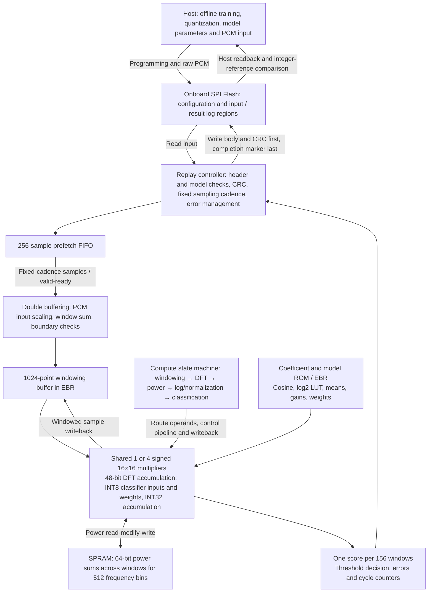

# Interview Materials: FPGA Acoustic Spectrum and INT8 Classification Accelerator

Project scope: run the complete fixed-point processing of raw sound and fault classification for covered fans on UPduino 3.1 using a configurable one-/four-MAC architecture. The project primarily demonstrates signal processing, RTL scheduling, fixed-point numerical design, verification, and debugging on a physical FPGA.

The current scope is new recordings from four covered MIMII machine IDs, with independent weights and thresholds for each machine. There are no microphone capture, unfamiliar-machine generalization, ASIC tape-out, or power measurement results. Present only work you can explain and reproduce, and accurately disclose AI assistance used during development.

## Architecture Diagram

This is a logical diagram; actual resource utilization comes from place-and-route results. Model ROM is initialized during configuration; no CPU executes Python at runtime. The four-lane DFT processes the real and imaginary components of two frequency bins per group. Non-DFT stages currently use mainly multiplier lane 0, demonstrating hardware reuse while leaving room for optimization.

## Performance Table

Both columns below use machine 00, the same fault recording `00000094.wav`, the same model, the same bit widths, and the same nominal 12 MHz configuration. Cycles and scores come from saved physical-board logs; resources and Fmax come from tool reports for the matching firmware.

|Metric|One MAC|Four MACs|Interpretation|
|---|---:|---:|---|
|Processed samples / windows|159744 / 156|159744 / 156|Identical complete input|
|Windowing and preprocessing cycles|479232|479232|Serial in the current implementation|
|DFT cycles|164216832|41174016|3.9884× faster in this stage|
|Power processing and related cycles|2551452|2551452|Includes decomposition of wide squares, power RAM reads/writes, and some control|
|Log, normalization, and classification cycles|18128|18128|`cycles_nn` includes more than the INT8 dot product|
|All active computation cycles|167265644|44222828|**3.7823× overall speedup**|
|Active computation time at 12 MHz|13.9388 s|3.6852 s|Excludes idle waiting; not total user wait time|
|Input cadence, cycles/sample|1500|750|The one-MAC baseline requires a slower replay rate|
|First sample to result, nominal time|20.0587 s|10.0091 s|Capture overlaps computation; excludes host programming and log export|
|Last sample to result, nominal time|90.855 ms|25.127 ms|Excludes Flash result writing|
|Final integer score / threshold|9622 / −1029|9622 / −1029|Bit-for-bit identical|
|Post-placement LCs|4682|5178|LC count must not be treated as a pure LUT count|
|Synthesis LUT4 / independent FF|3713 / 1497|4192 / 1653|Excludes registers internal to macros|
|DSP / EBR / SPRAM|1 / 25 / 1|4 / 28 / 1|Four lanes approach device capacity|
|Final routed Fmax|13.8989 MHz|13.3138 MHz|Both pass the 13.2 MHz constraint; tool estimates|
|Cumulative passing physical-board windows|1248|2184|156 windows per startup, accumulated across multiple runs|

**Why is the speedup not exactly four?** DFT accounts for approximately 98.18% of the active cycles in the one-MAC implementation. Four lanes reduce that portion to approximately one quarter, but approximately 3048812 non-DFT cycles remain unchanged. The DFT also has pipeline fill, drain, result storage, and control overhead:

`167265644 / (41174016 + 3048812) = 3.7823`

The DFT itself is 3.9884× faster, and the complete computation is 3.7823× faster. The two architectures use different input cadences, so the reduction in total latency from approximately 20 to 10 seconds cannot be called the four-lane computation speedup. The four-MAC implementation's 3.685 seconds of active computation are distributed across 9.984 seconds of audio input. Capture and computation overlap and must not simply be added.

The actual HFOSC frequency and power consumption have not been measured; seconds in the table are nominal times. Log normalization loop counts vary slightly between recordings, so total cycles need not be identical. Six other matched-input pairs also yield approximately 3.78× speedup; see the [physical-board report](known-hardware-results.md).

## Why Logistic Regression Was Selected

Early sparse-frequency features with an MLP still missed anomalies from machine 00. Retaining 512 bins proved more effective with a linear model than expanding the MLP. The current model was selected using 192 development recordings per machine in three folds, then refitted on those 192 recordings. Normalization parameters use training data only; thresholds use independent normal calibration recordings.

The model uses L2 logistic regression, C=1, max_iter=3000, and seed=71. Hardware needs only a 512-term dot product and bias, with no hidden layer, activation function, or sigmoid. Inputs and weights are INT8, classification accumulation is INT32, and the DSP front end retains sufficient bit width for precision.

This is an engineering choice based on recorded experiments, not evidence that linear models are better for every acoustic problem. Features and calibration rules also changed during the early experiments, so all improvement cannot be attributed to the model alone. See the [training explanation](known-training-explained.md) for the complete training process.

After freezing, the 720 reserved recordings yielded 317/320 anomalies detected (99.06%), 8/400 false alarms on normal recordings (2.00%), and pooled AUC 0.99841. Each of the four IDs passed the original gates. These results must not be described as accuracy on unknown machines, independent acquisition sessions, or field data.

## A Real Debugging Case: A Missing 2³⁰ Power Scale

**Problem.** The earlier floating-point/INT8 classifier distinguished normal and faulty recordings, but after integration with the complete integer DSP in v1, development detection fell to 0/384 and AUC to 0.5. This 0.5 is the result of an actual failed implementation, separate from the approximately 0.5 AUC of a shuffled-label control.

**Diagnosis.** Rather than immediately replacing the model or increasing bit widths, the training features and integer DSP units were compared. Training used squared raw PCM counts; the integer implementation temporarily output power normalized by PCM/32768. The amplitude differed by 2¹⁵ and the squared power by 2³⁰, shifting all log2 features by 30, or 122880 in Q12. The error occurred before normalization and moved features outside the training distribution.

**Correction.** Restore 30 bits in the log-power scale constant so power uses the same PCM-count units as training. For the fixed N=1024 and 156 windows, the current constant is `round((24+log2(156))×4096)=128145`. The model was not adjusted based on the final test.

**How to avoid both implementations making the same mistake?** Add an absolute-power check using a coherent-bin sine with known amplitude, together with DC/extreme-value cases, independent scalar integer multiply-accumulate checks, log LUT error checks, and fixed-point boundary checks. Rebuild the v2 development features and evaluation afterward. Pooled development results recovered to 378/384 detected, 8/384 false positives, and AUC 0.99862. The failed v1 results were retained; RTL and physical-board verification followed the correction.

**30-second explanation.** “When migrating floating-point features to integer DSP, I encountered a complete performance collapse. Stage-by-stage comparison showed that it was a power-unit mismatch, rather than model capacity: it shifted every log2 feature by 30. I unified the PCM power scale and used an absolute-power test with a known-amplitude sine to prevent the reference model and RTL from sharing the same error, then continued with intermediate-value and physical-board verification.”

Evidence: `artifacts/acoustic-known-integer-pipeline-v1/results.json`, `artifacts/acoustic-known-integer-pipeline-v2/results.json`, `tests/test_known_fixed.py::test_coherent_sine_absolute_power_scale`, and `src/vibfpga/known_fixed.py::power_log_q12`. This is an explainable, reproducible unit error; do not present it as field troubleshooting that was never performed.

## Proving the Hardware Computes Correctly Beyond Matching Classifications

1. **Numerical contract:** fix each stage's bit width, signedness, RNE, saturation, scale, and threshold comparison rule.
2. **Independent arithmetic checks:** use scalar Python integer dot products, known-amplitude sines, and related checks rather than only comparing implementations that share code.
3. **Stage-by-stage RTL comparisons:** compare windowed samples, DFT real/imaginary outputs, current-window power, cross-window sums, log values, INT8 features, and final scores. Current one-/four-MAC runs cover 1092 windows each and 3361799 intermediate checks per architecture.
4. **Interfaces and errors:** test input/output stalls, reset during processing, boundaries, and buffering. One MAC explicitly reports overload at nominal 16 kS/s; resetting with a slower replay cadence recovers successfully.
5. **Physical replay:** put raw PCM in Flash, compute on the FPGA, and read back logs with CRC and commit markers. Confirm matching model, bitstream, and input hashes, two identical raw readbacks, and scores/counters matching the integer reference.

Matching second readback alone does not prove overall correctness. It contributes evidence together with CRC, model binding, the numerical reference, and preceding RTL verification. All internal intermediate values were not directly captured from the board; simulation observations must not be confused with physical probe measurements.

## 60–90-Second Introduction

“This project implements acoustic fault classification on a resource-constrained UPduino FPGA. The host handles training and quantization. Starting from raw PCM, the FPGA performs DC removal, Hann windowing, computation of 512 frequency components, power statistics across windows, and INT8 linear classification.

My main focus is reusing the same multipliers between DSP and classification, and comparing one-MAC and four-MAC architectures. For the same recording, four lanes reduce active computation cycles by approximately 3.78×. Stage counters explain why the gain is less than four.

For verification, I fixed rounding and saturation rules, checked intermediate values in RTL, exercised stalls, resets, and overload, and actually wrote raw recordings to the board and read back checksummed results. The 720 frozen test recordings yielded 99.06% detection and 2% false positives. These are new recordings from the same source and four covered devices, not results for unfamiliar machines or field deployment.”

During practice, be able to open the source and identify each module discussed. This script is a project introduction template, not a substitute for personal understanding or an accurate account of your contributions.

## Common Follow-up Questions and Answer Points

|Question|Answer points|
|---|---|
|Is this still a hardware project?|The main cost is the complete DFT, wide accumulation, RAM organization, handshakes, and scheduling. A small model makes the architecture and verification easier to explain.|
|Why not use an FFT?|The current DFT facilitates MAC reuse and a bit-accurate reference, and meets the target cadence. An FFT may be more efficient for the complete spectrum, but no implementation comparison under matching conditions has been performed; do not claim the DFT is optimal.|
|Why are all four DSPs not busy throughout?|The DFT pipeline is parallel; preprocessing, square decomposition, power RAM access, and single-output classification remain serial. Device capacity and control complexity constrain further optimization.|
|Is the system real-time?|The four-MAC core passed 1092 continuous simulated windows with a fixed nominal 16 kS/s input cadence. Physical-board runs replay 156 windows per startup at a fixed cadence. The output is an approximately 10-second recording-level decision, not a 64 ms alarm.|
|Why use different parameters for different machines?|Covered devices have different normal spectra, and the task is recognition for installed equipment. Installation configuration must specify the ID; the system does not identify the machine automatically.|
|Does AUC=1 indicate overfitting?|Finite-sample scores can be perfectly ranked. Assess this together with frozen testing, leakage screening, and acquisition independence. Label shuffling supports an association between audio and labels but cannot exclude background cues.|
|Does the project include JTAG, ASIC, or mixed-signal work?|This project uses SPI Flash programming and an FPGA digital implementation. There are no JTAG debugging, analog-front-end design, or ASIC sign-off results; do not mix the terms.|
|What should be optimized next?|Use stage cycles to choose a bottleneck, such as an FFT front end or power-stage bandwidth. Compare under the same data, precision, and constraints, rather than reporting only theoretical peak MAC throughput.|

## Demo Sequence and Material Entry Points

First open the [audio and computation walkthrough](../artifacts/known-recording-walkthrough/index.html), play short normal/fault excerpts, and explain that the scores come from saved physical-board records. Then follow one sample, one frequency bin, and the final dot product for the first window. Finish with the performance table explaining 3.78× speedup and the unit-error debugging case.

- Principles and stepwise values: [complete walkthrough of one recording](known-recording-walkthrough.md).
- Training and data boundaries: [training explanation](known-training-explained.md).
- Frozen quality metrics: [final test](known-final-test.md).
- Physical-board, resource, and throughput evidence: [hardware report](known-hardware-results.md).
- Reproduction script for this walkthrough: `scripts/trace_known_recording.py`; no retraining, test-set evaluation, or programming was performed for the walkthrough.
