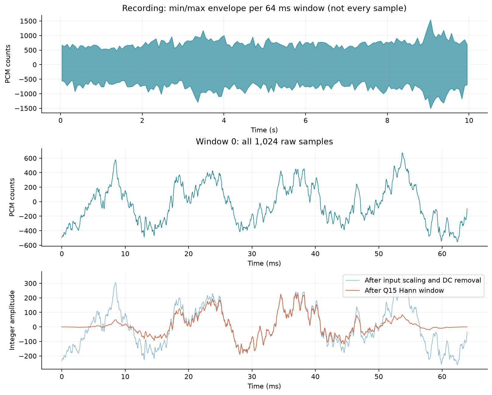
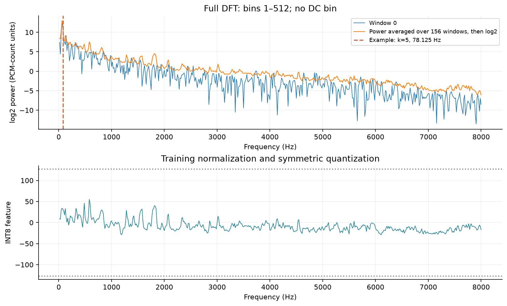
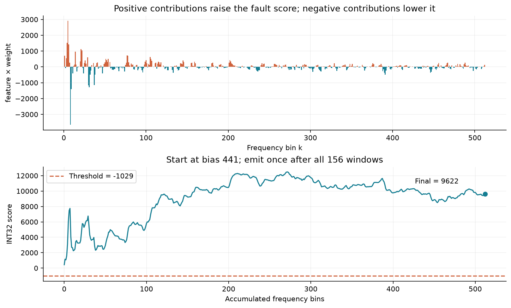

# Following One Recording: From Sound to an FPGA Score

Start with the [playable walkthrough](../artifacts/known-recording-walkthrough/index.html). It includes one normal and one faulty sound clip, three plots, and a selector for all 512 frequency-bin values. Open `index.html` within its complete directory; no network service is required. Playback runs on the computer and does not trigger the FPGA again.

This walkthrough fixes the development recording `fan/id_00/abnormal/00000094.wav` from machine 00. Its true label is faulty; the saved four-MAC physical-board score is **9622**, the threshold is **−1029**, and the decision is faulty. The recording participated in development and final model fitting. It is useful for tracing calculations but cannot establish generalization; metrics for the 720 held-out test recordings are in the [final test report](known-final-test.md).

## 1. Distinguish a recording from a window

The original data is a 16 kHz, eight-channel recording. This project fixes channel 0. The model processes the first 159744 PCM16 samples, totaling 9.984 seconds; the trailing 256 samples are unused.

Every 1024 samples form a 64 ms window, giving 156 windows. Each window has its own spectrum; powers are aggregated across all 156 windows, and the whole recording produces one final score. **The score of 9622 is not available when the first 64 ms window ends.**

PCM values are digital recording amplitudes, not calibrated sound pressure. The waveform's horizontal axis is time and its vertical axis is amplitude. The top plot below uses per-window maxima and minima for the whole-recording envelope; the middle plot shows all 1024 samples of the first window.



## 2. A sample worked through: −267 → −59

Use sample 256 of the first window, counting from zero. Hardware rounding is RNE: round to the nearest integer, choosing the even integer at an exact tie.

| Step | Actual operation | Result |
| --- | --- | ---: |
| Original PCM | Read sample 256 | −267 |
| Input scaling | −267÷2=−133.5; tie to even | −134 |
| Window mean | Sum of 1024 scaled samples is −16853; divide by 1024 with RNE | −16 |
| DC removal | −134−(−16) | −118 |
| Hann coefficient | 16384÷32768 | 0.5 |
| Integer multiplication | −118×16384 | −1933312 |
| Restore amplitude scale | RNE right shift by 15 | −59 |

DC removal removes the offset shared by the window. Windowing smoothly brings the edges toward zero, reducing spectral leakage caused by selecting a short segment. Windowing changes amplitude, so training and hardware must use the same conventions.

In the source, `known_capture.sv` first scales inputs and accumulates the window sum. `IDLE` in `known_spectral_core.sv` computes the mean; `PRE_READ → PRE_MULT → PRE_STORE` reads samples, multiplies by the window, and stores them. The raw input buffer is released once windowing finishes. The DFT then reads a separate windowed buffer, allowing acquisition and computation to overlap.

All 1024 samples are in the [per-sample CSV](../artifacts/known-recording-walkthrough/window-000.csv); check the record with `sample=256`. The CSV also includes per-sample real and imaginary products for the selected bin.

## 3. What the DFT measures

The DFT multiplies and accumulates the window against sines and cosines at different frequencies, measuring the strength of each periodic pattern. For bin k, the frequency is `k×16000/1024`, with 15.625 Hz spacing. Hardware computes k=1…512, covering 15.625 Hz to 8 kHz and omitting DC.

The real component uses cosine; the imaginary component uses negative sine. Together they describe amplitude and phase. Power is `Re²+Im²`, reducing dependence on the starting phase of the same sinusoid.

Bin 5, **78.125 Hz**, is used as the example because it makes a relatively large positive contribution for this recording. The model still uses all 512 bins and was not modified for this illustration. This does not establish 78.125 Hz as a fault-characteristic frequency.

| First window, bin 5 | Actual integer value |
| --- | ---: |
| Sum of 1024 real products | 415939144 |
| Sum of 1024 imaginary products | 707059158 |
| Real component: RNE right shift by 8 | 1624762 |
| Imaginary component: RNE right shift by 8 | 2761950 |
| Power: RNE((Re²+Im²)/256) | 40110231872 |

This is integer power with fixed scaling, not physical acoustic energy. DFT accumulation uses 48 bits, real/imaginary results use 32 bits, and squared sums and cross-window powers use 64 bits. **INT8 describes classifier weights and features; it does not mean every DSP stage is eight bits wide.**

RTL state `DFT_INIT` clears accumulators, `DFT_RUN` pipelines samples through coefficients, multipliers, and accumulators, and `DFT_SAVE` rounds and stores results. In the four-lane version, each group covers the real/imaginary components of two bins, such as `Re(k=1), Im(k=1), Re(k=2), Im(k=2)`; it does not compute four complete bins at once.

## 4. How 156 windows become 512 features

Power for each bin is accumulated over windows. Bin 5's integer power sum over 156 windows is **9115875909310**, stored in SPRAM. `P_READ/P_CAPTURE/P_SUM/P_WRITE` reads the old sum, adds the new value, and writes it back. The first window initializes each address directly, so clearing the entire RAM beforehand is unnecessary.

Power is then converted back to training units, divided by 156, and transformed with log2. The implementation folds scaling and division by the window count into a subtracted constant:

`log_q12 = exponent×4096 + log2_LUT[mantissa] − 128145`

This bin produces **48193**, corresponding to log2 power of about **11.7659**. The order is **average power first, then take the logarithm**; averaging per-window logarithms would be different.



Training determines a mean and scale for each bin. Bin 5 uses the following parameters and operations:

| Step | Value |
| --- | ---: |
| Recording log power, Q12 | 48193 |
| Training mean, Q12 | 41988 |
| Difference | 6205 |
| Normalization gain, Q24 | 86850 |
| 64-bit integer product | 538904250 |
| RNE right shift by 24, saturate to −127…127 | **32** |

Q12 stores a real value multiplied by 4096 as an integer; Q24 similarly uses 2²⁴. The gain already includes the standard deviation and INT8 input scale, so runtime floating-point division is unnecessary. This recording has zero centering saturations and zero feature saturations. Other inputs still require saturation and error checks.

## 5. From 512 features to a score of 9622

The current model is supervised logistic regression with a separate parameter set for each machine. Training on the computer finds 512 weights and one bias. The board calculates only the linear score and does not need a sigmoid.

Bin 5 has feature 32 and INT8 weight 91, contributing **32×91=2912**. Positive products raise the fault score; negative products lower it. A positive weight does not always raise the score: the sign of the normalized feature also matters.

The sum of all 512 products is **9181**. Adding bias **441** gives:

`score = 441 + Σ(qx[k]×qw[k]) = 9622`

Since `9622 > −1029`, the output is faulty. The threshold comes from separate normal calibration recordings; it was not chosen after inspecting this recording. Scores and margins are not probabilities, and their magnitudes cannot be directly compared across different machines' integer models.



The accumulation curve's horizontal axis is the bin index, **not recording time**. On the final window, RTL processes final power, logarithm, normalization, and score accumulation bin by bin. It does not need to store an extra 512-dimensional feature array before classification. The plots and explanation separate these logical operations for clarity.

All values are in the [features and MAC CSV](../artifacts/known-recording-walkthrough/features-and-mac.csv); bin 5's per-window powers are in the [cross-window accumulation CSV](../artifacts/known-recording-walkthrough/selected-bin-across-windows.csv).

## 6. Connect the algorithm, state machine, and evidence

| Algorithm stage | RTL state/module | Existing simulation observation point |
| --- | --- | --- |
| Input scaling, window boundaries, and sum | `known_capture` | accepted_samples, protocol_errors |
| DC removal and Hann windowing | `PRE_READ / PRE_MULT / PRE_STORE` | dbg_kind=0: windowed sample |
| Real/imaginary DFT | `DFT_INIT / DFT_RUN / DFT_SAVE` | kind=1/2: rounded real/imaginary components |
| Sum of squares | `REAL_INIT / WM_PREP / WM_ACC` | kind=3: current-window power |
| Cross-window power accumulation | `P_READ / P_CAPTURE / P_SUM / P_WRITE` | kind=4: running power sum |
| log2 lookup | `LOG_INIT / LOG_SHIFT / LOG_LOOKUP / LOG_COMPUTE` | kind=5: final log power |
| Fixed-point normalization | `NORM_INIT / WM_PREP / WM_ACC` | kind=6: INT8 feature |
| Classifier multiply-accumulate | `NN_MULT / NN_ACC` | Final score checked at kind=7 |
| Output and hold | `FRAME_DONE / HOLD` | kind=7: score and output handshake |

`WM_*` reuses the same multiplication hardware to decompose wide products. `purpose` distinguishes real squaring, imaginary squaring, and normalization. The retained `NN_*` state names do not imply that the current model still has a hidden layer.

Source links: [computation state machine](../rtl/core/known_spectral_core.sv), [double-buffered acquisition](../rtl/core/known_capture.sv), [board integration](../rtl/upduino_known.sv), and [Python integer reference](../src/vibfpga/known_fixed.py).

The application ties `out_ready` to 0 to hold its single result until reset. The replay controller writes the score, counters, model hash, and CRC to Flash, then writes the commit marker last. A handshake exists; this application intentionally retains the result of only one recording.

Saved physical-board readback for this recording: score=9622, threshold=−1029, class=1, accepted=generated=159744, and errors=protocol_errors=0. Two identical raw readbacks are stored in `measurements/known-replay/id00-l4-record1-r1/`.

The walkthrough script's recomputation matches nine groups of fields in saved RTL regression vectors. Independent Python integer-scalar checks also cover the selected DFT bin, all features, and classifier accumulation. Intermediate values were not captured from board probes in this run; they combine software recomputation with existing RTL simulation evidence. The final score is compared directly with an existing physical readback.

## 7. Reproduce and check your understanding

Run from the project root:

```bash
source scripts/env.sh
python scripts/trace_known_recording.py
```

The script validates frozen inputs, recomputes this development recording, checks existing vectors and raw physical-board logs, and rebuilds CSVs, plots, audio, and HTML. It does not train, access final test recordings, rerun simulation, or operate USB.

After reproduction, expect `score: 9622`, `threshold: -1029`, and all five checks true. Machine 00's normal comparison recording is `normal/00000304.wav`, with saved physical-board score −6361. Both WAVs retain their original PCM and are not independently volume-normalized.

Try answering these questions before consulting the explanations: Why can one window not yet produce the final score? Why is a negative-number right shift insufficient to replace RNE? Why are 48/64-bit values needed in an INT8 design? Why is utilization of each DSP lane not always 100%? Explanations and interview organization are in the [interview material](known-interview-pack.md).
